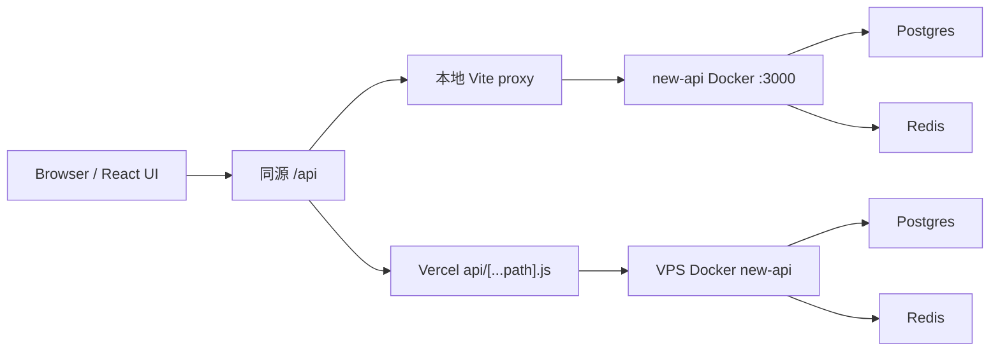

# 架構草案

## 核心結構

- 前端：Vercel + React
- 前端 API 入口：同源 `/api`
- 本地 API 代理：Vite proxy -> `http://localhost:3000`
- Vercel API 代理：`api/[...path].js` -> `NEW_API_ORIGIN`
- 後端：VPS Docker 上的 `new-api`
- 本地開發：Docker Compose
- 正式部署：VPS + Docker Compose

## 依賴優先級

1. `new-api`
2. Docker Compose
3. 現成資料庫與快取
4. 現成 UI/設計系統
5. 現成表格、表單、圖表元件

## 不做的事

- 不自己重寫 gateway 核心
- 不自己重寫 auth、審計、限流、計費
- 不用假資料假裝有後端

## 已接資料流

登入與邀請碼流程：

1. `GET /api/status` 檢查後端。
2. `POST /api/user/login` 建立 new-api session。
3. `POST /api/user/register` 使用 `aff_code` 做邀請碼註冊。
4. `GET /api/user/self` 讀取角色與個人額度。
5. `GET /api/token/` 讀取 API Key。
6. 管理員額外讀 `GET /api/user/` 與 `GET /api/channel/`。
